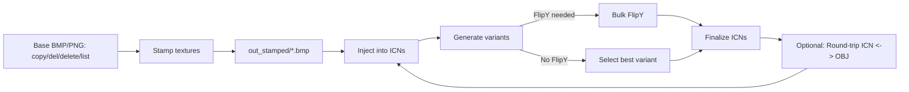

# PS2 Save Icon Workflow

This repository provides a **clear, step-by-step workflow** for taking base PS2 save icon models (`.icn`) and textures, stamping or skinning them, generating transform variants, and finalizing them for deployment — all in an **easy-to-follow pipeline**.

---

## 1) Prerequisites

You will need the following installed or available in your PATH:
- **Python 3.9+**
- **Pillow** (Python Imaging Library fork) → install with:
```bash
pip install pillow
```
- **Blender** *(optional)* for manual UV editing or remapping.

---

## 2) Repository Layout

```
repo-root/
├── copy.bmp / copy.png
├── del.bmp / del.png
├── delete.bmp / delete.png
├── list.bmp / list.png
├── box.txt
├── transforms.cfg
├── doubleclick-stamper.bat
├── Make_ICN_Candidates_All_Transforms.bat
├── Rename_FlipY_ICN_All_Subfolders.bat
├── icn_texture_replace.py
├── stamp_like_example.py
├── ps2icon_to_obj.exe
├── obj_to_ps2icon.exe
└── icn_files/ (your working ICNs go here)
```

> **Tip:** Keep your working `.icn` files inside `icn_files/` so you can cleanly batch-process without affecting the repo itself.

---

## 3) Visual Workflow



### Step Legend

| Step | Description |
|------|-------------|
| **A** | Place your `copy.bmp`, `del.bmp`, `delete.bmp`, `list.bmp` (or PNG) into the root. |
| **B** | Run `doubleclick-stamper.bat` (use ` ` when prompted to skip text stamping). |
| **C** | The processed textures appear under `out_stamped/`. |
| **D** | Use `icn_texture_replace.py` to inject the stamped textures into ICNs. |
| **E** | Run `Make_ICN_Candidates_All_Transforms.bat` to generate transform variants. |
| **F** | If needed, run `Rename_FlipY_ICN_All_Subfolders.bat` to fix Y-flip. |
| **G** | Manually pick the best variant if no FlipY needed. |
| **H** | Finalize icons by selecting the desired ICN files. |
| **I** | (Optional) Convert ICNs to OBJ and back for manual remapping. |

---

## 4) Batch Files — What They Do

| File | Purpose |
|------|---------|
| **doubleclick-stamper.bat** | Prompts for optional text, stamps the images, writes output to `out_stamped/`. |
| **Make_ICN_Candidates_All_Transforms.bat** | Automatically generates rotated/flipped variants of your ICNs for testing. |
| **Rename_FlipY_ICN_All_Subfolders.bat** | Mass-renames FlipY variants so they are selected automatically by wLE or other loaders. |

---

## 5) Python Scripts

| Script | Purpose |
|--------|---------|
| **icn_texture_replace.py** | Injects new textures into `.icn` files without altering geometry. |
| **stamp_like_example.py** | Demonstrates stamping workflow in pure Python for automation or headless environments. |

---

## 6) Optional Tooling

| Tool | Purpose |
|------|---------|
| **ps2icon_to_obj.exe** | Converts `.icn` to `.obj` for editing in Blender/Milkshape. |
| **obj_to_ps2icon.exe** | Converts edited `.obj` back into `.icn` for testing. |

---

## 7) Example Full Workflow

1. Place base textures (`copy.bmp`, `del.bmp`, `list.bmp`, etc.) in repo root.
2. Run `doubleclick-stamper.bat` → creates `out_stamped/*.bmp`.
3. Run `icn_texture_replace.py` to inject textures into working `.icn` files in `icn_files/`.
4. Run `Make_ICN_Candidates_All_Transforms.bat` to generate rotation/flip variants.
5. If needed, run `Rename_FlipY_ICN_All_Subfolders.bat`.
6. Manually select best candidates from generated folders.
7. (Optional) Convert ICNs to OBJ with `ps2icon_to_obj.exe`, edit UVs in Blender, then convert back with `obj_to_ps2icon.exe`.
8. Copy finalized `.icn` files into your PS2 save folder for deployment.

---

## 8) Notes & Tips

- **Order matters:** Always stamp & replace textures *before* generating transform candidates.
- **Non-destructive:** This pipeline never deletes your originals; always works from copies.
- **OBJ round-tripping:** Only needed if vertex UVs are broken or you need manual re-map.

---

## License

MIT License — feel free to fork and improve this workflow.
