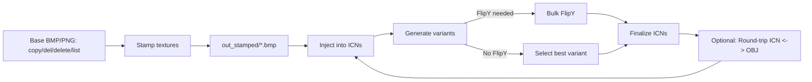

# PS2 Save Icon Toolchain — Quick-Start Repo (Sample)

This sample has a minimal, working folder layout plus placeholder scripts so you can wire up your real tools.
Use it as a template and replace the stubs with your production scripts/exes.

## Prerequisites

- Windows 10+
- Python 3.9+
- `pip install pillow` (if you use the real stamper)

## Layout

```
<repo-root>/
  copy.bmp  del.bmp  delete.bmp  list.bmp
  box.txt
  transforms.cfg
  doubleclick-stamper.bat
  Make_ICN_Candidates_All_Transforms.bat
  Rename_FlipY_ICN_All_Subfolders.bat
  icn_texture_replace.py
  stamp_like_example.py
  .gitignore
  ICONS/APP_Example/{copy.icn, del.icn, list.icn}
  out_stamped/           (generated)
  CANDIDATES/            (generated)
```

## One-Screen Run

```bat
REM 1) Stamp (or a single space for texture-only)
doubleclick-stamper.bat

REM 2) Inject stamped textures to ICNs
python icn_texture_replace.py

REM 3) Build transform candidates
Make_ICN_Candidates_All_Transforms.bat

REM 4) If needed, auto-select FlipY
Rename_FlipY_ICN_All_Subfolders.bat
```

## Visual Flow



### Legend
- **Stamp textures** = `doubleclick-stamper.bat`
- **Inject into ICNs** = `icn_texture_replace.py`
- **Generate variants** = `Make_ICN_Candidates_All_Transforms.bat`
- **Bulk FlipY** = `Rename_FlipY_ICN_All_Subfolders.bat`

---

> Replace the placeholder `.bat`/`.py` files with the real implementations from your toolchain.
